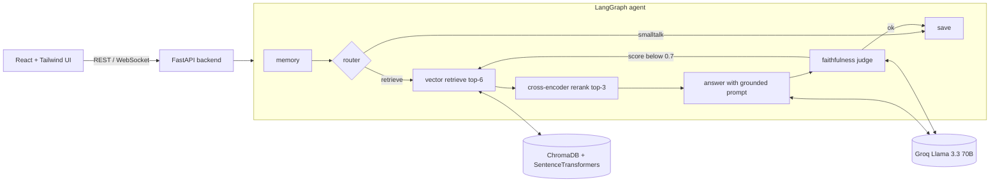

<div align="center">

# 🤖 ML Research Assistant

**A full-stack, hallucination-resistant RAG system that answers machine-learning questions strictly from a curated knowledge base — with a live evaluation dashboard that proves it.**


</div>

---

## ❓ The problem

Large language models confidently make things up. For a domain assistant — where a wrong answer about, say, the bias-variance tradeoff is worse than no answer — **groundedness matters more than fluency.**

This project is a Retrieval-Augmented Generation (RAG) assistant that answers **only** from a curated ML knowledge base, **refuses** out-of-scope questions, and **measures its own faithfulness** on every response. It isn't a chatbot wrapper — it's a small, evaluated system.

## ✨ What makes it complete

| Capability | Detail |
|---|---|
| **Grounded RAG** | Answers restricted to retrieved context; refuses when the KB doesn't cover the question. |
| **Cross-encoder reranking** | Vector recall (top-6) is reranked with `ms-marco-MiniLM-L-6-v2` down to the 3 best passages, raising context precision. |
| **Faithfulness-gated answers** | Every answer is scored by an LLM-as-judge; scores below threshold trigger a bounded **retry with wider retrieval**. |
| **Lightweight router** | Greetings / chit-chat / out-of-scope traffic is short-circuited before retrieval. |
| **Live evaluation dashboard** | One click runs a RAGAS-style suite (faithfulness, answer relevancy, context precision) and renders the scores, a per-question table, and the **before-vs-after improvement** from reranking. |
| **PDF ingestion** | Upload research papers; they're embedded and added to the index at runtime. |
| **Full-stack + DevOps** | FastAPI backend (REST + WebSocket streaming), React/Vite/Tailwind frontend, Dockerized, GitHub Actions CI. |

## 🏗️ Architecture



## 🧱 Tech stack

| Layer | Technology |
|---|---|
| Frontend | React 18, Vite, Tailwind CSS, Recharts |
| Backend | FastAPI, Uvicorn, WebSockets |
| Orchestration | LangGraph (stateful graph + checkpointer) |
| LLM | Groq — Llama 3.3 70B |
| Retrieval | ChromaDB · SentenceTransformers (`paraphrase-MiniLM-L3-v2`) |
| Reranking | CrossEncoder (`ms-marco-MiniLM-L-6-v2`) |
| Evaluation | Custom RAGAS-style LLM-as-judge |
| DevOps | Docker, docker-compose, GitHub Actions |

## 🚀 Quick start

### Option A — Docker (one command)
```bash
cp .env.example .env        # add your free GROQ_API_KEY
docker compose up --build
# frontend -> http://localhost:3000   |   API -> http://localhost:8000/docs
```

### Option B — Local dev
```bash
# 1. Backend
cp .env.example .env        # add GROQ_API_KEY
pip install -r backend/requirements.txt
uvicorn backend.main:app --reload --port 8000

# 2. Frontend (new terminal)
cd frontend
npm install
npm run dev                 # http://localhost:5173 (proxies /api to :8000)
```

Get a free Groq API key at <https://console.groq.com/keys>.

## 📊 Evaluation

Open the **Evaluation Dashboard** tab and click *Run evaluation*, or run the CLI:

```bash
python -m backend.evaluation     # writes ragas_baseline.json
```

| Metric | Meaning | Target |
|---|---|---|
| Faithfulness | Answer is grounded in retrieved context | ≥ 0.70 |
| Answer Relevancy | Answer addresses the question | ≥ 0.75 |
| Context Precision | Retrieved context is on-topic | ≥ 0.70 |

The dashboard also reports the **context-precision improvement from cross-encoder reranking** versus the vector-only baseline.

## 🔌 API

| Method | Route | Purpose |
|---|---|---|
| `GET` | `/api/health` | Liveness + model info |
| `GET` | `/api/topics` | KB topics grouped by category |
| `POST` | `/api/chat` | Ask a question → answer, sources, faithfulness |
| `WS` | `/api/chat/stream` | Token-streamed answer |
| `POST` | `/api/upload` | Add PDF papers to the index |
| `POST` | `/api/evaluate` | Run the evaluation suite |
| `GET` | `/api/metrics` | Last computed metrics |

Interactive docs at `http://localhost:8000/docs`.

## 📁 Project structure

```
.
├── backend/
│   ├── main.py          # FastAPI app (REST + WebSocket)
│   ├── agent.py         # LangGraph agent: router, retrieve, rerank, answer, eval, retry
│   ├── kb.py            # Curated ML knowledge base (single source of truth)
│   ├── evaluation.py    # RAGAS-style LLM-as-judge scoring
│   ├── requirements.txt
│   ├── Dockerfile
│   └── tests/           # CI tests (no API key required)
├── frontend/            # React + Vite + Tailwind (chat + dashboard)
├── .github/workflows/ci.yml
└── docker-compose.yml
```

## 🗺️ Roadmap
- [ ] Persistent ChromaDB volume across restarts
- [ ] True token-level streaming from the LLM (not post-hoc word streaming)
- [ ] Conversation export + history
- [ ] HyDE / query rewriting for multi-turn retrieval

## 📄 License
MIT
